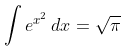

# Latex

#### Description

_Sends Latex written equations_

| Usage | Aliases |
| :---: | :---: |
| cw!latex &lt;Equation&gt; | math, maths |
| @Clawful Latex &lt;Equation&gt; |  |

#### Arguments

| Parameter | Type | Optional |
| :---: | :---: | :---: |
| Equation | Numbers and letters for equation | ❌ |

#### Example 1

```text
cw!latex \int e^{x^2}\,dx = \sqrt{\pi}
```



#### Example 2

More complicated equations:

```text
cw!latex \begin{align}
    \left|\partial^l(fe^{ix\cdot z})\right| &=\left|\sum{\alpha\leq l}\prod{i}\binom{l_i}{\alphai}\partial^\alpha f\partial^{l-\alpha}e^{ix\cdot z}\right| \
    &\leq \sum{\alpha\leq l}\prod_{i}\binom{l_i}{\alphai}\left|\partial^\alpha f\right|\left|\partial^{l-\alpha}e^{ix\cdot z}\right|\
    &=\sum{\alpha\leq l}\prod_{i}\binom{l_i}{\alphai}\left|\partial^\alpha f\right|\left|\prod{j}z_j^{l_j-\alphaj}i^{|l-\alpha|}e^{ix\cdot z}\right|\
    &\leq\sum{\alpha\leq l}\prod_{i} \binom{l_i}{\alpha_i}FN^\alpha |x|^{-N}\prod{j}z_j^{l_j-\alphaj}i^{|l-\alpha|} \
    &= |x|^{-N}\sum{\alpha\leq l}\prod_{i}\binom{l_i}{\alpha_i} FN^\alpha \prod{j}z_j^{l_j-\alpha_j}i^{|l-\alpha|}\
    &=|x|^{-N}M_N^{l}.
\end{align}
```


